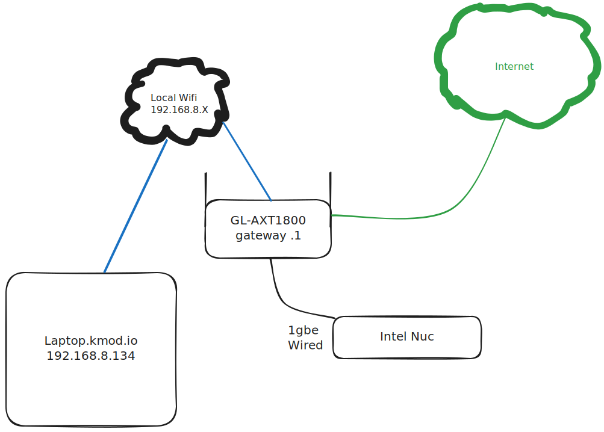

# Single Node OpenShift Disconnected on Intel Nuc

In this setup we have the below hardware, take note that the GL wifi router is only connected to the internet during the OCP Bin pull (collect_ocp) and the registry_mirror OCP hydration process

For DNS we will use the GL.iNet wifi router, and for the subnet we will use the default 192.168.8.0/24

* Thinkpad X1 Nano
* Intel Nuc 13 Pro Kit
  * 64 gb DDR4
  * Samsung 2TB nvme
* GL.iNet GL-AXT1800

## Setup

### GL-AXT1800
* Standard setup, default wifi pwd on sticker as "Key"
  * Cable LAN2 to your internet uplink or setup wifi uplink to your home router via https://192.168.8.1/#/internet
### ThinkPad X1 Nano
* Fedora41 standard install
  * wifi connected to GL-ATX1800
  * sudo dnf install podman git nmstatectl -y
  * sudo dnf update -y
  * hostnamectl laptop.kmod.io
### Intel Nuc 13 Pro Kit
* Standard bios setup
  * hard wired to gbe LAN1(GL-ATX1800)
  * Current ## issue, bios time needs to be set to local time zone time

