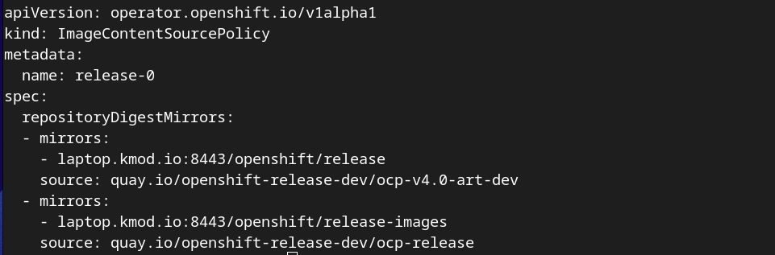

# Single Node OpenShift Disconnected on Intel Nuc

In this setup we have the below hardware, take note that the GL wifi router is only connected to the internet during the OCP Bin pull (collect_ocp) and the registry_mirror OCP hydration process

For DNS we will use the GL.iNet wifi router, and for the subnet we will use the default 192.168.8.0/24

* Thinkpad X1 Nano
  * 200+ gb free space
* Intel Nuc 13 Pro Kit
  * 64 gb DDR4
  * Samsung 2TB nvme
* GL.iNet GL-AXT1800
* Sandisk usbc USB 1.2 gb

## Basic Hardware Setup

### GL-AXT1800
* Standard setup, default wifi pwd on sticker as "Key"
  * Cable LAN2 to your internet uplink or setup wifi uplink to your home router via https://192.168.8.1/#/internet
### ThinkPad X1 Nano
* Fedora41 standard install
  * wifi connected to GL-ATX1800
  * sudo dnf install podman git nmstatectl -y
  * sudo dnf update -y
  * hostnamectl laptop.kmod.io
### Intel Nuc 13 Pro Kit
* Standard bios setup
  * hard wired to gbe LAN1(GL-ATX1800)
  * Current ## issue, bios time needs to be set to local time zone time

## DNS on GL-AXT1800 - OCP Requirements
https://192.168.8.1/cgi-bin/luci/admin/network/dhcp

| Item | Value |
| ------------ | ----------- |
| cluster name | ocp.kmod.io |
| api          | 192.168.8.199 |
| master0      | 192.168.8.199 |
| laptop       | 192.168.8.134 |
| apps         | 192.168.8.199 |

*note:* rendezvousIP will be 192.168.8.199 in this case

*Current hardware setup*
----------------------------------------------

## Now lets prep the laptop 

This will collect the reqired OpenShift tools to executed a SNO (Single Node OpenShift) install on the Intel Nuc (Disconnected). As well as get the repo and images required for the disconnected install. 

### Clone a base repo to collect the ocp binary, the collect_ocp will download the below files

- oc-mirror
- openshift-install
- openshift-client (OC, kubectl)
- mirror-registry
- butane

> cd $HOME
> 
> git clone https://github.com/kodonnellredhat/ocp417.git && cd ocp417
>
> ./collect_ocp

### Setup a registry on the laptop (Quay Light (Mirror Registry))

> mirror-registry/mirror-registry install

Save your output

### Configure the firewall to allow inbound access to the registry

>sudo firewall-cmd --permanent --add-port=80/tcp 
>
>sudo firewall-cmd --permanent --add-port=443/tcp 
>
>sudo firewall-cmd --permanent --add-port=8443/tcp

### Copy the mirror registry Cert into your trust-store

> sudo cp ~/quay-install/quay-rootCA/rootCA.pem /etc/pki/ca-trust/source/anchors/quay-rootCA.pem
>
> sudo update-ca-trust

### Authenticate to the redhat.registry.io and your mirror-registry

- Download your pull secret from: https://console.redhat.com/openshift/install/pull-secret
 
> cp ~/Downloads/pull-secret.txt ~/.docker/config.json
>
> or 
>
> cp ~/Downloads/pull-secret.txt $XDG_RUNTIME_DIR/containers/auth.json

- podman login laptop.domain.com with your output from the mirror-registry install

> podman login -u init -p $PASSWORD laptop.kmod.io:8443
>
> -Optional --authfile ~/.docker/config.json

### Launch quay (mirror-registry) in your web browser

> https://laptop.kmod.io:8443

## Now lets populate our registry

In this case we are going to pull the content from the internet and push it directly into the mirror-registry that is running on the laptop. For fully disconnected OpenShift deployment we would modify this step and write the images collected from oc-mirror to local tar files to then move to the disconnected mirror-registry or v2 compatable registry.

### Using oc-mirror

> cat imageset-config.yaml

Populate the laptops registry.

> oc-mirror --config imageset-config.yaml docker://laptop.kmod.io:8443

Save you output, you will need this to build out your install-config as well as to apply to the cluster post deployment. 

You can also find this output in the oc-mirror log file

> cat .oc-mirror

## Time to disconnect from the Internet! 

## Configure the openshift install-config and agent-confg

Lets modify the sno-ocp agent-config and install-config to build out our openshift cluster. Two examples are available in the $HOME/ocp417/ocp/sno-nuc directory for us to work with. 

> cd $HOME/ocp417/ocp/sno-nuc

### install-config content collection

As we get started in this section I will review the main areas of the install-config that we would like to modify however if you would like to dig a bit deepter in specific sections or taylor the config in other ways you can use the explain function to get additional information. 

> openshift-install explain installconfig
>
> openshift-install explain installconfig.sshKey

To prepare for this process lets get some content outputed to add to the install-config

- If you dont already have an sshkey setup generate one via sshkey-gen or cat out your existing public key. 

> cat $HOME/.ssh/id_rsa.pub

- Output your mirror-registry ssl cert trust bundle

> cat $HOME/quay-install/quay-rootCA/rootCA.pem

- Output your oc-mirror imagecontentsourcepolicy (note this is the config that has the openshift-installer look at your OCP mirror content location for the OpenShift cluster deployment).

*Note:* your results directory below will be unique to your oc-mirror execution

> cat $HOME/ocp417/oc-mirror-workspace/results-1732206898/imageContentSourcePolicy.yaml

*Note:* this is the section of the ICSP that we will use for the install-config (release-0)

- Output your mirror-registry pull-secret

> cat ~/.docker/config.json

*Note:* we will use the entry with laptop.kmod.io here

### install-config modifications

Please use the existing install-config format with your values from the above output. 

> vi install-config.yaml

- add your ssh key to the install config in 

> sshKey: ''

- add your sslcert to the install config in

> additionalTrustBundle: |

- add your imagecontentsourcepolicy to the install config in

> imageDigestSources:

- add your mirror-registry pull-secret to the install config in

> pullSecret: FORMAT: '{"auths":{"": {"auth": ""}}}'

### agent-config modifications

The agent config does require some knowledge of the nuc device id's and mount locations. We have multiple ways to caputure this information. The common ones are to boot to a fedora or rhcos instance and inspect them. With the rhcos approach, we could use the default values in this agent config and move to the next step. During the initial boot phases we can inspect the hardware via ssh to the rendezvousIP.

Please use the existing agent-config format with your values

### Wrapup and backup of the configuration files. 

During the creation of the agent image the openshift-install will consume your agent and install config files. Let make sure that we take a backup copy of them. Add to your favorite source control. 

> mkdir -p bk && cp * bk/

## Create the agent image and write it to the usb-c drive

- create the agent image file

> openshift-install agent create image --log-level debug

*note: * this process will create a auth dir, the agent iso and a rendezvousIP file. We will write the iso to usb and the auth dir contains the info for the kubeadmin user of the cluster. 

- insert your usb key into your laptop

> df -h

It is most comon for the device to show up as /dev/sda 

*Note:* this process will erase everything on the usb key and format it with the agent installer image. 

> sudo dd if=agent.x86_64.iso of=/dev/sda status=progress

## Boot the Intel Nuc to the usb drive to install OpenShift

Lets get the usb with the agent install into the nuc and reboot it

